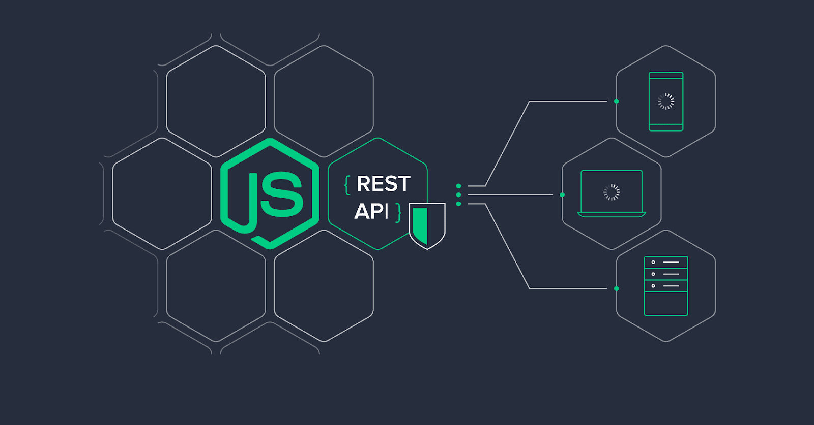

<!--
<!-- PROJECT LOGO -->
 

  

     
    <a href="https://github.com/byolabisi/REST-API-in-Nodejs"><strong>Explore the docs »</strong></a>
     
     
    ·
    <a href="https://github.com/byolabisi/REST-API-in-Nodejs/issues">Report Bug</a>
    ·
    <a href="https://github.com/byolabisi/REST-API-in-Nodejs/issues">Request Feature</a>
  

